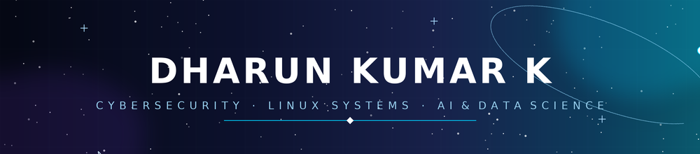

<!--
=====================================================================
  GITHUB PROFILE README — Dharun Kumar K
  Theme: Science & Space 🚀 — Bright Neon Cosmic (Purple/Cyan/Pink/Yellow)
  This file must live in a repo named EXACTLY your GitHub username
  (e.g. github.com/dhxrun1/dhxrun1) and be public.
=====================================================================
-->

<!-- BANNER (self-hosted, lives in your own repo — no third-party service, so it never breaks) -->

<!-- TYPING ANIMATION -->

<!-- SOCIAL BADGES -->

 

## 🪐 About Me

B.Tech **Information Technology** student (2023–2027) at **PSNA College of Engineering and Technology**, orbiting around **cybersecurity, Linux systems, and AI/data science** — with hardware and front-end builds fueling the mission whenever a project calls for it. Running Linux full-time, aiming for systems-level engineering, with **Linus Torvalds** as launch inspiration.

- 🐧 Linux-only setup — comfortable deep in the core, not just the surface
- 🔐 Certified in **Red Hat System Administration** and **Cisco networking fundamentals**, steering toward cybersecurity
- 🛰️ Built a portable **VOC-based health monitoring system** (Raspberry Pi + ML) and a **hostel management platform** used by real students
- 🧠 Solved **150+ problems on LeetCode** — charting a course through DSA
- 🏆 **1st Prize** — TeamUp Project, College-Level Hackathon | **2nd Prize** — Smart India Hackathon (SIH) 2025
- 🎖️ **Red Hat Student Ambassador** | Vice President — Salesforce Club
- 📡 Reach me at **dharunorg965@gmail.com**

 

## 🔭 Tech Stack

**Languages**
 

**Databases & Cloud**
 

**AI / ML & Data**
 

**Tools & Platforms**
 

 

 

## 🛸 Featured Missions

<table>
<tr>
<td width="50%" valign="top" align="center">

### 🩺 AIRA
Portable VOC-based health risk detection system for real-time breath analysis, built on Raspberry Pi with an ML pipeline.

 

    

  

</td>
<td width="50%" valign="top" align="center">

### 🏠 Hostel Management
Full-stack hostel platform streamlining food reviews, communication, and fee tracking for students.

 

  

  

</td>
</tr>
<tr>
<td width="50%" valign="top" align="center">

### 🤝 TeamUp
🏆 1st Prize, College-Level Hackathon — a platform helping students find teammates for hackathons and projects.

 

 

  

</td>
<td width="50%" valign="top" align="center">

### 👤 Face Recognition Attendance
Automated student attendance system using real-time face recognition.

   

  

   

<!-- Replace <<FACE_ATTENDANCE_REPO>> once you confirm the repo name -->

</td>
</tr>
</table>

 

 

## 📡 GitHub Analytics

 

 

<b>🏆 GitHub Trophies</b>

 

 

## 🌌 Career Goals

Aiming to grow as a **Cybersecurity / Systems Engineer**, with strengths in AI, data science, and hardware-integrated development — building on a Linux-first foundation and a long-term mission toward systems-level and security engineering.

## 🛰️ Current Learning

`Cloud Computing (AWS)` · `Docker & Containerization` · `Advanced Machine Learning` · `Networking`

 

## 🏅 Achievements & Certifications

<table>
<tr>
<td width="50%" valign="top">

**🏆 Awards**

</td>
<td width="50%" valign="top">

**🎖️ Leadership**

</td>
</tr>
<tr>
<td width="50%" valign="top">

**📜 Certifications**

</td>
<td width="50%" valign="top">

**🧩 Problem Solving**

</td>
</tr>
</table>

 

## 📬 Let's Connect

Always open to discussing full-stack projects, ML systems, IoT builds, or just talking tech across the galaxy 🌠

  

*Thanks for stopping by — always launching, always learning.* 🚀

